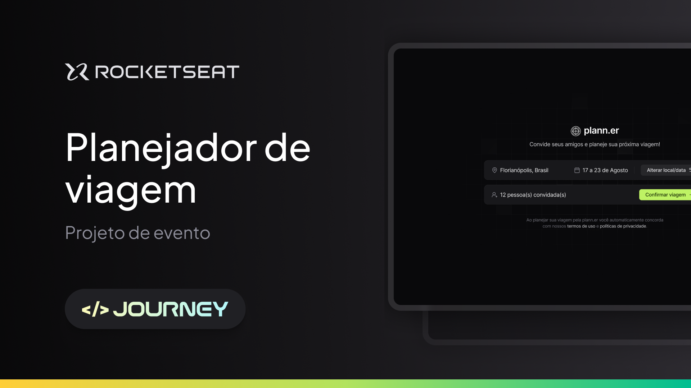

<h1 align="center">
  NLW Journey (React)
</h1>

<p>
  
</p>

<h4 align="center"> 
	🚀 Aplicação finalizada 🚀
</h4>

## 💻 About

Esta aplicação de nome **Plann.er** consiste em um site desktop para montar planos de viagem com amigos, registrar atividades e links úteis.


### Cloning and Running

Passo a passo para clonar e executar a aplicação na sua máquina:

```bash
$ yarn install
or
$ npm install
```

```bash
# Run Project
$ yarn dev
or
$ npm run dev

```

## 🛠 Technologies

As seguintes principais ferramentas foram usadas na construção do projeto:

- **[React + Vite](https://vitejs.dev/)**
- **[TypeScript](https://www.typescriptlang.org/)**
- **[TailwindCSS](https://tailwindcss.com/)**
- **[TailwindCSS Variants](https://www.tailwind-variants.org/)**
- **[React Router DOM](https://reactrouter.com/)**
- **[Lucide React](https://lucide.dev/)**
- **[React Day Picker](https://daypicker.dev/)**
- **[date-fns](https://date-fns.org/)**
- **[Axios](https://axios-http.com/ptbr/docs/intro)**


## 👤 Author

**Carlos Oliveira**

- LinkedIn: [@CarlosOliveira](https://www.linkedin.com/in/carlos-oliveira-ab93941a1/)

---

## 📝 License

Copyright © 2024 [Carlos Oliveira](https://github.com/carlossroliveira).<br />
This project is [MIT](https://opensource.org/licenses/MIT) licensed.

---
